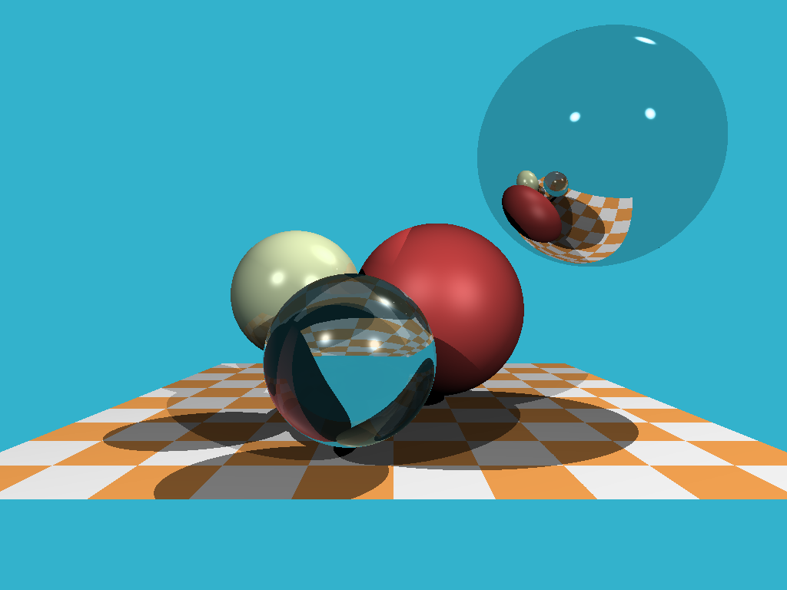
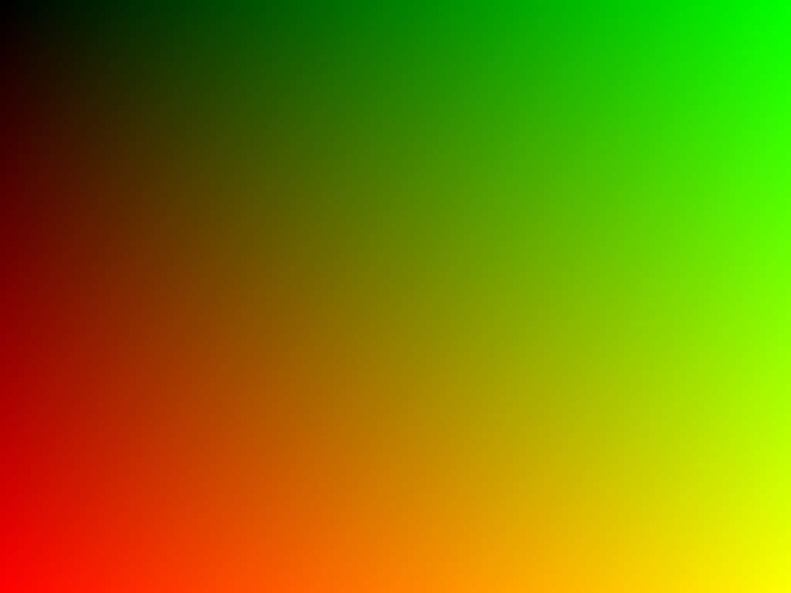
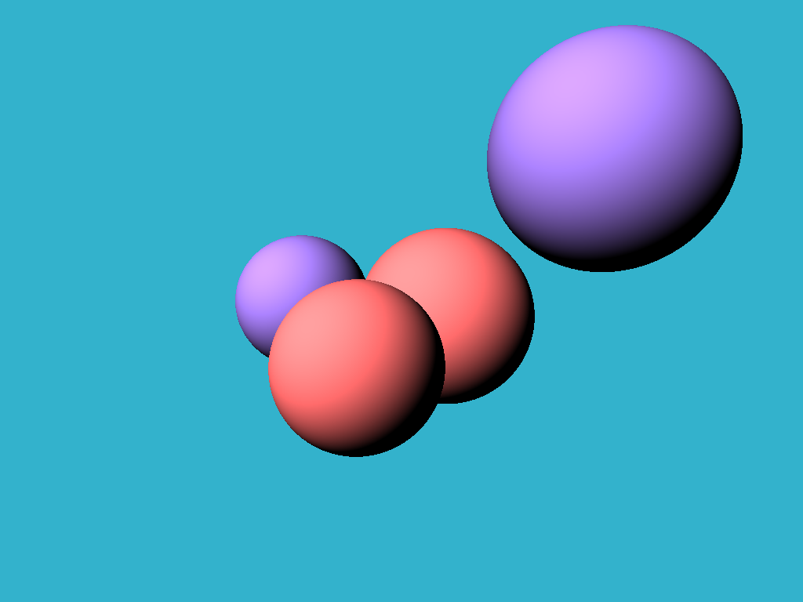
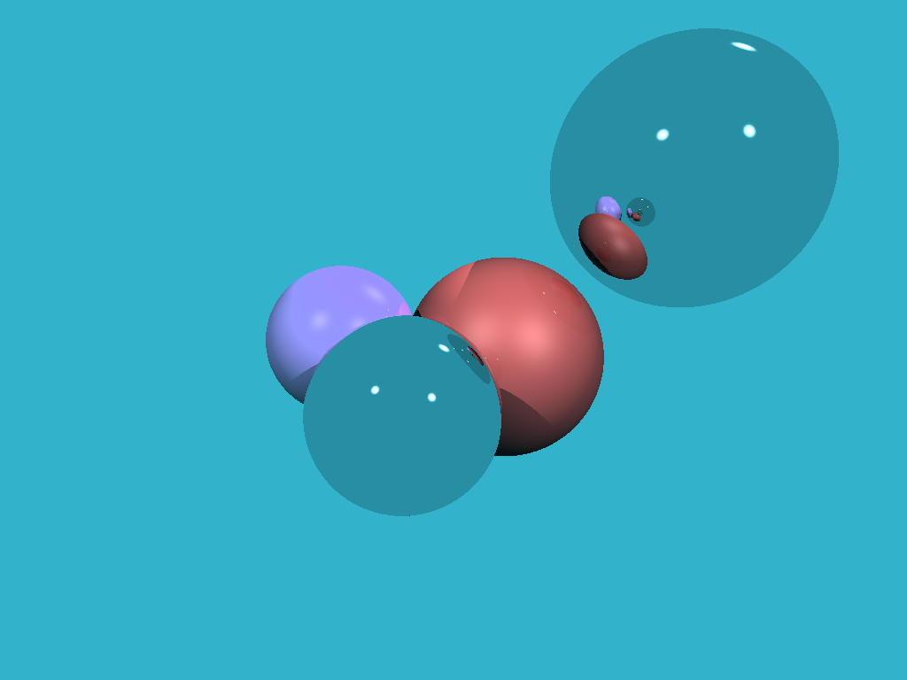
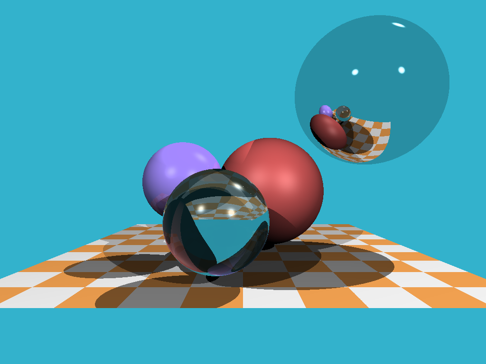

# 笔记整理

## 光线追踪实践（一）生成基础图片

https://zhuanlan.zhihu.com/p/432385515

## 光线追踪实践（二）画一个纯色球

https://zhuanlan.zhihu.com/p/433138837

## 光线追踪实践（三）多个球体与基础光照

https://zhuanlan.zhihu.com/p/434030501

## 光线追踪实践（四）高光、阴影和反射

https://zhuanlan.zhihu.com/p/439639130

## 光线追踪实践（五）折射和棋盘

